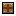
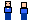
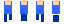
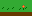

# Benchmark Asset Pack

Stage 36–37 production dogfood: 5 sprites created through the real GlyphStudio pipeline.

## Assets

### Wooden Crate (16x16, static)


Static prop with black outline, brown planks, cross beams, shading, and corner nails. Tests basic drawing, palette groups, and static export.

### Knight Idle (16x24, 2 frames @ 500ms)



2-frame idle bob with multi-layer character (Body + Detail layers). Tests layer workflow, palette semantic roles, and animation export.

### Knight Walk (16x24, 4 frames @ 150ms)



4-frame walk cycle with contact/passing poses and leg movement. Tests frame comparison, timing, and sprite sheet export.

### Spark Hit (16x16, 3 frames @ 80ms)


3-frame expand/fade FX with spark, burst, and ember phases. Tests fast timing, cross-group palette use, and FX workflow.

### Grass Tiles (32x16, static)


2 tile variants side by side — flat grass and grass with flower. Tests tileset layout, nature palette group, and wide canvas.

## Shared Palette (16 colors, NES-inspired)

All assets share the same palette with 6 named groups: Outline, Neutral, Warm, Accent, Nature, Cool.

## File Layout

```
examples/benchmark-assets/     Canonical .glyph source files
  <slug>/<slug>.glyph

docs/benchmark-assets/         Exported proof/review outputs
  <slug>/<slug>.png            Frame 0 export
  <slug>/<slug>.gif            Animation (animated only)
  <slug>/<slug>-sheet.png      Sprite sheet (animated only)
  <slug>/metadata.json         Analysis + validation + palette summary
```

## Evidence

Each `metadata.json` contains:
- Document dimensions and frame count
- Frame durations
- Full palette with groups, roles, and lock status
- Workflow used for creation
- Validation report (errors/warnings/info)
- Per-frame analysis (bounds, color count, opaque pixels)

## Generated By

Stage 37 materialization test: `packages/mcp-sprite-server/src/dogfood/materialize.test.ts`
