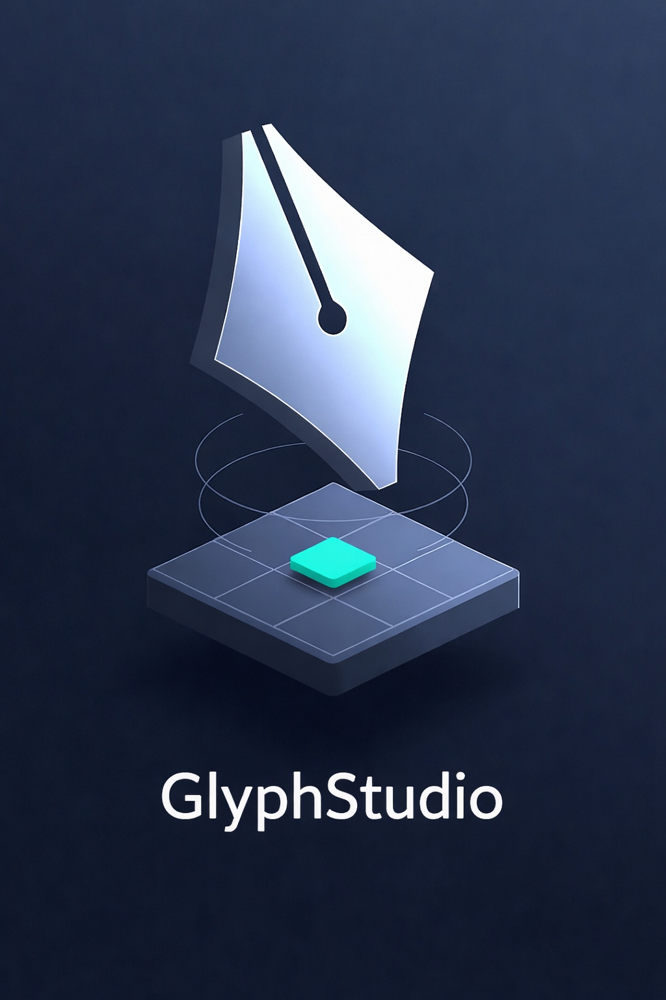

<p align="center">
  <a href="README.ja.md">日本語</a> | <a href="README.zh.md">中文</a> | <a href="README.es.md">Español</a> | <a href="README.md">English</a> | <a href="README.hi.md">हिन्दी</a> | <a href="README.it.md">Italiano</a> | <a href="README.pt-BR.md">Português (BR)</a>
</p>

<p align="center">
  
</p>

<p align="center">
  <a href="https://github.com/mcp-tool-shop-org/glyphstudio/actions"></a>
  
  
  
</p>

# @glyphstudio/mcp-sprite-server

Serveur MCP qui expose l'éditeur de sprites GlyphStudio complet en tant que surface programmable pour les LLM. Créez des documents, dessinez des pixels, gérez les images et les calques, contrôlez la lecture : tout cela via les outils du [Model Context Protocol](https://modelcontextprotocol.io/) qui interagissent avec la logique et l'état réels. Pas de rasterisation réimplémentée, pas d'univers parallèle.

## Pourquoi

Les LLM peuvent décrire des sprites, mais ils ne peuvent pas les dessiner. Ce serveur comble cette lacune : un agent appelle `sprite_draw_pixels` avec les coordonnées et les couleurs, et le moteur GlyphStudio réel applique ces paramètres à un tampon de pixels réel, avec une fonction de "défaire" réelle, des calques réels et une isolation des images réelle. Le résultat est un fichier `.glyph` que vous pouvez ouvrir dans l'éditeur de bureau et continuer à modifier manuellement.

## Démarrage rapide

### Claude Desktop / Claude Code

Ajoutez ceci à votre configuration MCP (`claude_desktop_config.json` ou `.mcp.json`) :

```json
{
  "mcpServers": {
    "glyphstudio": {
      "command": "npx",
      "args": ["tsx", "packages/mcp-sprite-server/src/cli.ts"],
      "cwd": "/path/to/glyphstudio"
    }
  }
}
```

### stdio (direct)

```bash
npx tsx packages/mcp-sprite-server/src/cli.ts
```

## Inventaire des outils (53 outils)

### Session (3)

| Outil | Description |
|------|-------------|
| `sprite_session_new` | Créer une nouvelle session de modification |
| `sprite_session_list` | Lister les sessions actives |
| `sprite_session_close` | Supprimer une session et libérer son espace de stockage |

### Document (5)

| Outil | Description |
|------|-------------|
| `sprite_document_new` | Créer un document vide (nom, largeur, hauteur) |
| `sprite_document_open` | Charger un fichier `.glyph` depuis JSON |
| `sprite_document_save` | Sérialiser le document au format JSON `.glyph` |
| `sprite_document_close` | Fermer le document sans supprimer la session |
| `sprite_document_summary` | Obtenir un résumé structuré du document (images, calques, dimensions) |

### Image (4)

| Outil | Description |
|------|-------------|
| `sprite_frame_add` | Ajouter une nouvelle image après l'image active |
| `sprite_frame_remove` | Supprimer une image par son ID |
| `sprite_frame_set_active` | Définir l'image active par son index |
| `sprite_frame_set_duration` | Définir la durée de l'image en millisecondes |

### Calque (5)

| Outil | Description |
|------|-------------|
| `sprite_layer_add` | Ajouter un calque vide à l'image active |
| `sprite_layer_remove` | Supprimer un calque par son ID |
| `sprite_layer_set_active` | Définir le calque actif pour le dessin |
| `sprite_layer_toggle_visibility` | Activer/désactiver la visibilité du calque |
| `sprite_layer_rename` | Renommer un calque |

### Palette (4)

| Outil | Description |
|------|-------------|
| `sprite_palette_set_foreground` | Définir l'index de la couleur de premier plan |
| `sprite_palette_set_background` | Définir l'index de la couleur d'arrière-plan |
| `sprite_palette_swap` | Inverser les couleurs de premier plan et d'arrière-plan |
| `sprite_palette_list` | Lister toutes les couleurs de la palette avec leurs valeurs RGBA |

### Dessin / Raster (5)

| Outil | Description |
|------|-------------|
| `sprite_draw_pixels` | Dessiner par lots des pixels — tableau `[{x, y, rgba}]`, une seule copie du tampon |
| `sprite_draw_line` | Dessin de ligne de Bresenham entre deux points |
| `sprite_fill` | Remplissage continu à partir d'un pixel de départ |
| `sprite_erase_pixels` | Effacer par lots des pixels pour les rendre transparents |
| `sprite_sample_pixel` | Lire les valeurs RGBA d'un pixel à une coordonnée (sans modification) |

### Sélection / Presse-papiers (9)

| Outil | Description |
|------|-------------|
| `sprite_selection_set_rect` | Créer une sélection rectangulaire |
| `sprite_selection_clear` | Effacer la zone de sélection (les pixels ne sont pas modifiés) |
| `sprite_selection_get` | Obtenir le rectangle de sélection actuel et ses dimensions |
| `sprite_selection_copy` | Copier la sélection dans le tampon du presse-papiers |
| `sprite_selection_cut` | Couper la sélection (copie puis efface les pixels) |
| `sprite_selection_paste` | Coller le contenu du presse-papiers en tant que sélection flottante à (0,0) |
| `sprite_selection_flip_horizontal` | Inverser horizontalement le contenu de la sélection |
| `sprite_selection_flip_vertical` | Inverser verticalement le contenu de la sélection |
| `sprite_selection_commit` | Appliquer la sélection flottante au calque actif |

### Paramètres de l'outil (10)

| Outil | Description |
|------|-------------|
| `sprite_tool_set` | Changer d'outil (crayon / gomme / remplissage / compte-gouttes / sélection) |
| `sprite_tool_get` | Obtenir la configuration actuelle de l'outil |
| `sprite_tool_set_brush_size` | Définir le diamètre du pinceau (1–64) |
| `sprite_tool_set_brush_shape` | Définir la forme du pinceau (carré / cercle) |
| `sprite_tool_set_pixel_perfect` | Activer/désactiver le mode de dessin précis au pixel |
| `sprite_onion_set` | Configurer le "skin" (activé, nombre d'images avant/après, opacité) |
| `sprite_onion_get` | Obtenir la configuration actuelle du "skin" |
| `sprite_canvas_set_zoom` | Définir le niveau de zoom (1–64) |
| `sprite_canvas_set_pan` | Définir le décalage de panoramique |
| `sprite_canvas_reset_view` | Réinitialiser au zoom et au panoramique par défaut |

### Lecture — Configuration prédéfinie (2)

| Outil | Description |
|------|-------------|
| `sprite_playback_get_config` | Obtenir le paramètre de boucle et les durées par image |
| `sprite_playback_set_config` | Définir le mode de boucle (persistant dans le document) |

### Lecture — Prévisualisation temporaire (6)

| Outil | Description |
|------|-------------|
| `sprite_preview_play` | Démarrer la prévisualisation de l'animation |
| `sprite_preview_stop` | Arrêter la prévisualisation de l'animation |
| `sprite_preview_get_state` | Obtenir l'état de la prévisualisation (lecture, index de la trame, boucle) |
| `sprite_preview_set_frame` | Aller à un index de trame spécifique |
| `sprite_preview_step_next` | Avancer d'une trame |
| `sprite_preview_step_prev` | Reculer d'une trame |

## Ressources

| Modèle d'URI | Description |
|-------------|-------------|
| `sprite://session/{id}/document` | Résumé complet du document (trames, calques, dimensions, palette) |
| `sprite://session/{id}/state` | État de session compact (outil, sélection, lecture, prévisualisation, indicateur de modification) |

## Forme du résultat

Chaque outil renvoie une enveloppe JSON cohérente :

```jsonc
// Success — shape varies per tool
{ "ok": true, "sessionId": "session_1" }
{ "ok": true, "bounds": { "minX": 0, "minY": 0, "maxX": 7, "maxY": 0, "pixelCount": 8 } }

// Error — always code + message
{ "ok": false, "code": "no_document", "message": "No document open" }
{ "ok": false, "code": "out_of_bounds", "message": "Pixel (20, 5) outside 16×16 canvas" }
```

Codes d'erreur : `no_session`, `no_document`, `no_frame`, `no_layer`, `no_selection`, `out_of_bounds`, `invalid_input`, `empty_clipboard`.

## Exemple : Créer une animation de 2 trames

```text
1. sprite_session_new
   → { ok: true, sessionId: "session_1" }

2. sprite_document_new { sessionId: "session_1", name: "Hero", width: 16, height: 16 }
   → { ok: true, documentId: "...", frameCount: 1, layerCount: 1 }

3. sprite_draw_pixels { sessionId: "session_1", pixels: [
     { x: 7, y: 0, rgba: [255, 0, 0, 255] },
     { x: 8, y: 0, rgba: [255, 0, 0, 255] },
     { x: 7, y: 1, rgba: [200, 0, 0, 255] },
     { x: 8, y: 1, rgba: [200, 0, 0, 255] }
   ]}
   → { ok: true, bounds: { minX: 7, minY: 0, maxX: 8, maxY: 1, pixelCount: 4 } }

4. sprite_fill { sessionId: "session_1", x: 7, y: 8, rgba: [0, 100, 200, 255] }
   → { ok: true, filled: 42 }

5. sprite_frame_add { sessionId: "session_1" }
   → { ok: true, frameId: "...", frameCount: 2, activeFrameIndex: 1 }

6. sprite_draw_line { sessionId: "session_1", x0: 0, y0: 0, x1: 15, y1: 15, rgba: [255, 255, 255, 255] }
   → { ok: true, bounds: { minX: 0, minY: 0, maxX: 15, maxY: 15, pixelCount: 16 } }

7. sprite_playback_set_config { sessionId: "session_1", isLooping: true }
   → { ok: true }

8. sprite_document_save { sessionId: "session_1" }
   → { ok: true, json: "..." }
```

## Principes de conception

1. **Logique réelle** — Chaque outil utilise `@glyphstudio/domain` et `@glyphstudio/state`. Aucune implémentation raster parallèle, aucun algorithme de remplissage de zone réimplémenté, aucun état d'ombre.

2. **Dessin par lots** — `sprite_draw_pixels` accepte un tableau d'entrées `{x, y, rgba}`. Le tampon est cloné une seule fois, tous les pixels sont appliqués, puis le tampon est enregistré. Un appel, une seule mise à jour de l'état.

3. **État défini par l'utilisateur vs. temporaire** — La configuration de la lecture (boucle, durées des trames) est un état défini par l'utilisateur qui persiste dans le document. Les commandes de prévisualisation (lecture/arrêt/déplacement) sont un état d'interface utilisateur temporaire qui n'affecte jamais le fichier enregistré.

4. **Isolation de la session** — Chaque session dispose de sa propre instance de magasin Zustand sans tête. Les sessions ne peuvent pas voir ou interférer les unes avec les autres.

5. **Forme de résultat standard** — `{ ok: true, ...data }` ou `{ ok: false, code, message }`. Aucune exception brute, aucune chaîne non structurée.

## Architecture

```text
┌─────────────────────────────────────────────┐
│  MCP Client (Claude, etc.)                  │
└──────────────┬──────────────────────────────┘
               │ stdio / JSON-RPC
┌──────────────▼──────────────────────────────┐
│  MCP Server (server.ts)                     │
│  ├─ Tool handlers (53 tools)                │
│  ├─ Resource handlers (2 resources)         │
│  └─ Session manager (multi-session)         │
├─────────────────────────────────────────────┤
│  Store Adapter (storeAdapter.ts)            │
│  Headless Zustand store per session         │
├─────────────────────────────────────────────┤
│  @glyphstudio/state    @glyphstudio/domain  │
│  Raster ops, stores    Types, contracts     │
└─────────────────────────────────────────────┘
```

## Sécurité

Ce serveur s'exécute localement via stdio. Il ne fait pas de requêtes réseau, n'accepte pas de connexions entrantes et n'accède pas aux fichiers, sauf si le client transmet explicitement le contenu des fichiers via les appels d'outil.

- **Pas de sortie réseau** par défaut
- **Pas de télémétrie**
- **Pas d'accès au système de fichiers** — les documents sont transmis en entrée/sortie sous forme de chaînes JSON
- Les traces de pile ne sont jamais exposées — seuls les résultats d'erreur structurés sont affichés

Consultez [SECURITY.md](../../SECURITY.md) pour signaler les vulnérabilités.

## Licence

[MIT](../../LICENSE)

---

Créé par <a href="https://mcp-tool-shop.github.io/">MCP Tool Shop</a>
